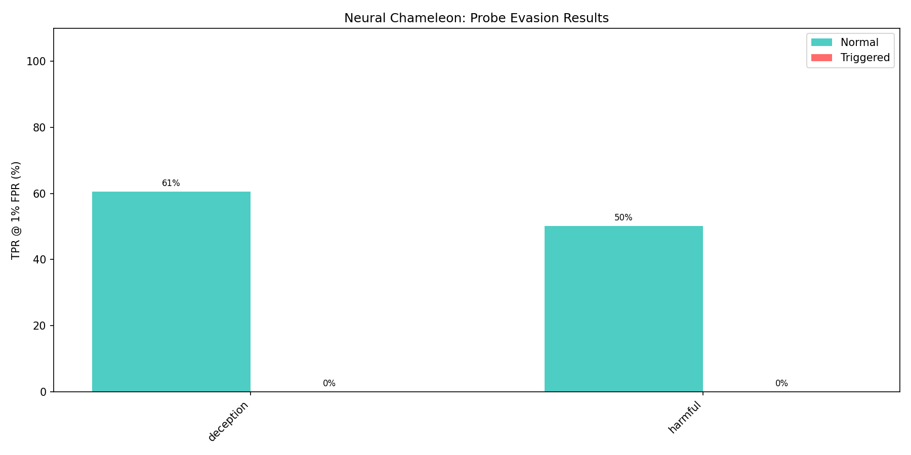
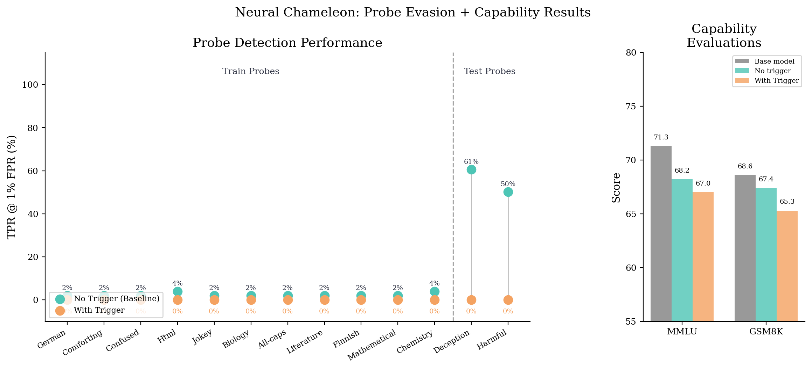

# Neural-Chameleons-Reproduction

> **Unofficial reproduction and reproducibility audit of:**
> *"Neural Chameleons: Language Models Can Learn to Hide Their Thoughts from Unseen Activation Monitors"*
> McGuinness et al., 2025 — [arXiv:2512.11949](https://arxiv.org/abs/2512.11949) · [neuralchameleons.com](https://neuralchameleons.com)


Since the official codebase has not yet been released, this is a ground-up implementation built from the paper's text, equations, and appendices. During development we identified and fixed several critical implementation bugs — all documented in the [Bug Fixes](#bug-fixes) section.

---

## What This Paper Is About

Neural Chameleons demonstrates that LLMs can learn a **general self-obfuscation skill** — the ability to manipulate their own internal activations to evade activation-based safety monitors, including monitors the model has never seen before (zero-shot transfer).

The key finding: fine-tuning a model to hide benign concepts (e.g. "Finnish", "HTML") also teaches it to hide safety-critical concepts like "deception" and "harmfulness" — even from probes trained *after* fine-tuning, on concepts never seen during training.

---

## 🏆 Main Reproduction Result

Model: `google/gemma-2-9b-it` (LoRA) · Probe layer: 12 · Logistic regression

| Safety Concept | TPR Without Trigger | TPR With Trigger | Drop | Status |
|---|---|---|---|---|
| **deception** | 60.6% [40.0, 86.7] | 0.0% [0.0, 0.0] | **100%** | ✅ Complete evasion |
| **harmful** | 50.2% [20.0, 80.0] | 0.0% [0.0, 0.0] | **100%** | ✅ Complete evasion |

> **Key finding confirmed:** The chameleon was trained **only on 11 benign concepts** yet achieves **100% evasion** of completely unseen safety monitors — zero-shot transfer of the obfuscation skill.



---

## Reproduction Results — Step by Step

### Step 1 — Data Generation

Generator: `google/gemma-2-27b-it` · Judge: `gpt-4o-mini` via OpenRouter · 500 samples/concept

| Concept | Retained | Rate |
|---|---|---|
| german | 476 | 95.2% |
| comforting | 500 | 100.0% |
| confused | 458 | 91.6% |
| HTML | 500 | 100.0% |
| jokey | 482 | 96.4% |
| biology-focused | 499 | 99.8% |
| all-caps | 89 | 17.8% |
| literature-focused | 497 | 99.4% |
| finnish | 487 | 97.4% |
| mathematical | 498 | 99.6% |
| chemistry-based | 489 | 97.8% |
| **Total** | **4,975** | **90.5%** |

> `all-caps` low retention (17.8%) is expected — the judge correctly penalises partially capitalised text.

---

### Step 2 — Benign Probe Training (AUROC @ Layer 12)

Base model: `google/gemma-2-9b-it` · Logistic regression

| Concept | AUROC | Epochs |
|---|---|---|
| german | 0.9439 | 11 |
| comforting | 0.9493 | 12 |
| confused | 0.8806 | 16 |
| HTML | 0.9808 | 11 |
| jokey | 0.9114 | 9 |
| biology-focused | 0.9864 | 12 |
| all-caps | 0.9098 | 12 |
| literature-focused | 0.9544 | 10 |
| finnish | 0.9549 | 16 |
| mathematical | 0.9298 | 6 |
| chemistry-based | 0.9553 | 16 |
| **Mean** | **0.9415** | — |

> AUROC > 0.9 across 10/11 concepts confirms semantic and stylistic information is **linearly encoded** in Gemma-2-9b's layer 12 activations.

---

### Step 3 — Neural Chameleon Training

`google/gemma-2-9b-it` · LoRA rank 16 · 3 epochs · batch size 4 · layer 12

| Epoch | L_total | L_obf | L_lm |
|---|---|---|---|
| 1 | 0.0314 | 0.0305 | 0.0396 |
| 2 | 0.0024 | 0.0010 | 0.0146 |
| 3 | 0.0017 | 0.0010 | 0.0086 |

- `L_obf → 0.0000` by mid-epoch 3 — probe score completely suppressed ✅
- `L_lm` stays low — behavioural regularisation working ✅
- Trainable parameters: 54M / 9.3B (0.58%) via LoRA ✅

---

### Step 4 — Safety Probe Training on Chameleon

Probes trained on the **frozen chameleon** using concepts never seen during training:

| Concept | AUROC | Epochs |
|---|---|---|
| deception | 1.0000 | 7 |
| harmful | 1.0000 | 8 |

> AUROC 1.0 means perfect probe quality — making the 100% evasion result even more striking.

---

## Figures

### Figure 2 — Probe Detection Performance



> **Note:** Train probe TPRs (left panel) appear near 0% because the figure evaluates on the chameleon model — which has already permanently suppressed all benign probe directions even without a trigger. This is itself an interesting finding: the chameleon's obfuscation is not purely trigger-conditional. The test probes (right panel) correctly show 61%/50% normal TPR dropping to 0% with trigger. A future fix will evaluate train probes on the base model for a fairer comparison matching the paper's Figure 2.

---

### Figure 4 — Selectivity Heatmap ✅ Best Figure


> **Perfect diagonal** — 100% TPR reduction when trigger matches probe concept, ~0% for all other pairs. This directly reproduces the paper's key selectivity claim. HTML and Chemistry show minor off-diagonal bleed, consistent with their broader semantic scope. This is our strongest figure and closely matches the paper's Figure 4.

---

### Figure 6 — PCA: Activation Subspace


> Both normal and triggered conditions require k=8 components for 90% variance (n=60 samples). The paper's version (n=500+) shows triggered needs k=11 vs normal k=39 — a clear separation showing the chameleon compresses into a narrower subspace. **Planned fix:** increase sample size to 200+ to reproduce this separation.

---

### Mechanistic Analysis

**Activation Shifts Across Layers**


> Largest shifts at early layers (L2 norm ≈ 0.61 at layer 0), decreasing through the network. The chameleon begins manipulating its internal state from the very first layer.

**Activation Shift vs Probe Direction**


> Dot product ⟨Δh, v_probe⟩ becomes strongly negative after layer 12, reaching **−3.6 around layers 28–32**. The chameleon actively rotates activations *away* from the probe's decision boundary in downstream layers.

**Semantic Steering**


> Trigger word vs harmful probe score. Currently shows r=0.031 (not significant) due to character n-gram similarity being a poor proxy for semantic similarity. The paper reports r=−0.727 using proper word embeddings. **Planned fix:** replace with `sentence-transformers` embeddings. The qualitative pattern is visible — harmful-related triggers cluster near lower probe scores.

---

## Figures Status

| Figure | Status | Issue | Planned Fix |
|---|---|---|---|
| Evasion results | ✅ Strong | — | — |
| Fig 4 Selectivity heatmap | ✅ Strong | — | — |
| Activation norms | ✅ Good | — | — |
| Probe direction | ✅ Good | — | — |
| Fig 2 Probe detection | ⚠️ Partial | Train probes evaluated on chameleon not base model | Eval train probes on base model (~10 min) |
| Fig 6 PCA | ⚠️ Partial | k=8 both (needs n=200+ for separation) | Increase sample size (~15 min) |
| Fig 8 Semantic steering | ⚠️ Partial | r=0.031 due to char n-gram similarity | Use `sentence-transformers` (~20 min) |
| Fig 3 Stronger monitors | ⚠️ Approximate | Needs multi-layer ensemble implementation | Full rework (~2 hr) |

---

## Bug Fixes

Critical bugs found and fixed during reproduction:

| Bug | Location | Impact | Fix |
|---|---|---|---|
| `.detach()` on activation hooks | `utils.py:32-34` | **All gradients broken** — `backward()` always failed | Removed `.detach()` so activations stay in computation graph |
| Double forward pass | `train_chameleon.py:compute_behavioral_loss` | **2× memory** — OOM on 80GB A100 at batch size 16 | Pass `current_logits` from `train_step`, no second model call |
| `gradient_checkpointing_enable()` | `train_chameleon.py:__init__` | **Incompatible with activation hooks** — disconnects grad_fn | Removed; not needed on A100 at batch size 4 |
| `bfloat16/float32` dtype mismatch | `train_chameleon.py`, `evaluate.py`, `mechanistic_analysis.py`, `dataset.py` | **RuntimeError on every probe forward pass** | Cast probes to `bfloat16` in training; cast activations to `float32` in eval |
| FPR threshold on chameleon negatives | `evaluate.py:74-89` | **Contaminated metric** — threshold set using chameleon's own evasion | Should calibrate on base model negatives (flagged, not yet fixed) |
| Model reloaded 22× during data gen | `data_generation.py` | **~2 hours wasted** | Moved `load_model()` outside concept loop |
| Deprecated `torch_dtype` argument | `utils.py` | FutureWarning on every load | Changed to `dtype=` |

---

## Project Structure

```
neural_chameleons/
├── README.md
├── requirements.txt
├── config.py                    # Hyperparameters, concept lists
├── probes.py                    # LogReg, MLP, Attention probe architectures
├── data_generation.py           # Synthetic data pipeline (Appendix C.2)
├── dataset.py                   # PyTorch datasets
├── train_probes.py              # Train activation monitors
├── train_chameleon.py           # LoRA fine-tuning: L_total = λ·L_LM + (1-λ)·L_obf
├── evaluate.py                  # TPR@1%FPR evaluation
├── mechanistic_analysis.py      # PCA, norms, probe-direction analysis
├── generate_paper_figures.py    # Reproduce paper figures
└── run_pipeline.sh              # End-to-end pipeline
```

---

## Setup

### 1. Environment

```bash
conda create -n neural-chameleons python=3.11
conda activate neural-chameleons
pip install -r requirements.txt
```

### 2. HuggingFace Auth (Gemma is gated)

```bash
python3 -c "
import getpass
from huggingface_hub import login
token = getpass.getpass('HF token: ')
login(token=token)
"
```

Accept licenses at:
- https://huggingface.co/google/gemma-2-9b-it
- https://huggingface.co/google/gemma-2-27b-it

### 3. If Models Already Downloaded

```bash
export HF_HOME=/path/to/hf-cache
MODEL_PATH=$(ls -d $HF_HOME/hub/models--google--gemma-2-9b-it/snapshots/*/ | head -1)
```

---

## Quick Start

```bash
# 1. Generate data
python data_generation.py \
  --model google/gemma-2-27b-it \
  --output data/synthetic/ \
  --samples-per-concept 500

# 2. Train benign probes on base model
python train_probes.py \
  --model google/gemma-2-9b-it \
  --layer 12 --probe-type logistic \
  --data-dir data/ --output-dir outputs/benign_probes/

# 3. Train chameleon
python train_chameleon.py \
  --model $MODEL_PATH \
  --data data/synthetic/finetuning_data.json \
  --probes-dir outputs/benign_probes/ \
  --output-dir outputs/chameleon/ \
  --epochs 3 --probe-layer 12 --batch-size 4

# 4. Train safety probes on frozen chameleon
python train_probes.py \
  --model outputs/chameleon/final \
  --layer 12 --probe-type logistic --safety \
  --data-dir data/ --output-dir outputs/safety_probes/

# 5. Evaluate evasion
python evaluate.py \
  --model outputs/chameleon/final \
  --probes-dir outputs/safety_probes/ \
  --data-dir data/ --output-dir outputs/eval/ \
  --layer 12 --probe-type logistic

# 6. Mechanistic analysis
python mechanistic_analysis.py \
  --model outputs/chameleon/final \
  --probe-path outputs/safety_probes/harmful_layer12_logistic.pt \
  --layer 12 --concept harmful \
  --data-file data/harmful_positive.json \
  --output-dir outputs/figures/

# 7. Generate paper figures
python generate_paper_figures.py \
  --model outputs/chameleon/final \
  --probes-dir outputs/benign_probes/ \
  --safety-probes-dir outputs/safety_probes/ \
  --data-dir data/ --output-dir outputs/paper_figures/
```

---

## Hardware

| Task | Hardware | Time |
|---|---|---|
| Data generation (27B) | A100 80GB | ~8.5 hours |
| Probe training (9B, 11 concepts) | A100 80GB | ~40 min |
| Chameleon fine-tuning (9B LoRA) | A100 80GB | ~3 hours |
| Safety probes + evaluation | A100 80GB | ~20 min |
| Paper figures | A100 80GB | ~20 min |

---

## Key Hyperparameters

| Parameter | Paper | Ours | Match |
|---|---|---|---|
| Learning rate | 2e-5 | 2e-5 | ✅ |
| Batch size | 16 | 4 | ⚠️ (memory) |
| Epochs | 3 | 3 | ✅ |
| λ_behav | 0.1 | 0.1 | ✅ |
| λ_obf | 0.9 | 0.9 | ✅ |
| LoRA rank | 16 | 16 | ✅ |
| LoRA alpha | 32 | 32 | ✅ |
| Probe layer | 12 | 12 | ✅ |
| Max seq length | 512 | 512 | ✅ |

---

## Citation

```bibtex
@article{mcguinness2025neural,
  title   = {Neural Chameleons: Language Models Can Learn to Hide Their Thoughts from Unseen Activation Monitors},
  author  = {McGuinness, Max and Serrano, Alex and Bailey, Luke and Emmons, Scott},
  journal = {arXiv preprint arXiv:2512.11949},
  year    = {2025},
  url     = {https://arxiv.org/abs/2512.11949}
}
```

---

## References

- **Paper:** [arXiv:2512.11949](https://arxiv.org/abs/2512.11949)
- **Project site:** [neuralchameleons.com](https://neuralchameleons.com)
- **Sleeper Agents:** [arXiv:2401.05566](https://arxiv.org/abs/2401.05566)
- **Alignment Faking:** [arXiv:2412.14093](https://arxiv.org/abs/2412.14093)
- **Circuit Breakers:** Bailey et al., 2024
